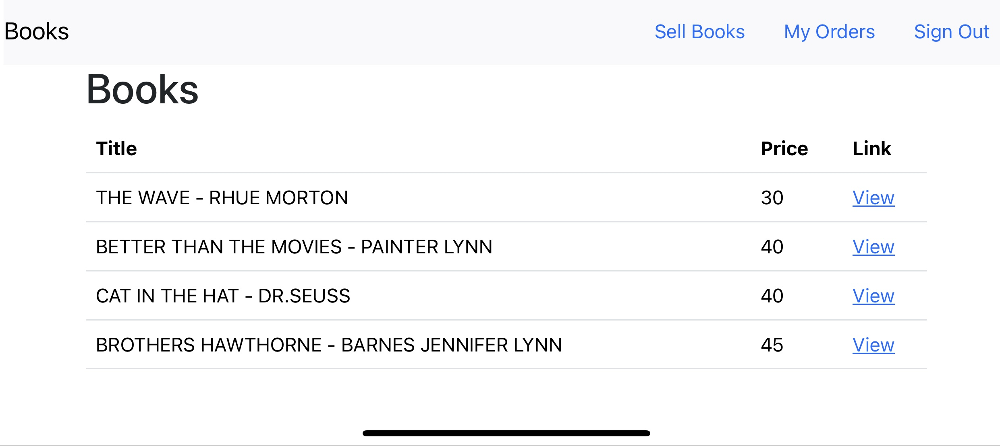

<h3 align="center">Books</h3>

  

    Microservices Project
       
    <a href="https://github.com/adi1988e/Books---Microservices-Project"><strong>Explore the docs »</strong></a>
     
     
    <a href="http://www.books-app-prod.shop">View Website</a>
    ·
    <a href="https://github.com/adi1988e/Books---Microservices-Project/issues">Report Bug</a>
    ·
  

 
<!-- ABOUT THE PROJECT -->

## About The Project
This Project Uses Docker and Kubernetes to deploy a multi-service app to Digital Ocean provider.  
In this application, users can buy or sell books if they have registered and connected to the site.   
The authentication on the site uses a JWT token, and the payment is via Stripe.

### Built With

* On the frontend, i used <strong> React </strong> and <strong> Next JS </strong> to present content to users.   
* Each service is created using <strong>  Node </strong> and <strong>  Express </strong>.   
* Data for each service is held in either a <strong>  Mongo database </strong> or <strong>  Redis </strong>.   
* The entire app is deployed and runs in <strong>  Docker </strong> containers executed in a <strong>  Kubernetes </strong> cluster.    
* Almost all of the code in this fullstack application written with <strong>  Typescript </strong>.

<!-- PROJECT SCREANSHOT -->
 

  
  

   

<!-- CONTACT -->
## Contact

Adi Mars - adi1988e@gmail.com

Project Link: https://github.com/adi1988e/Books---Microservices-Project

Website Link: http://www.books-app-prod.shop

